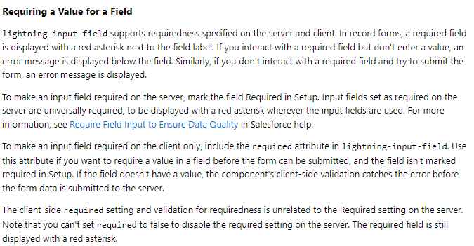

# Entregable Global66 

# Los componentes desarrollados : 
## administrarContactos :

    Este componente LWC se utiliza para mostrar una tabla de contacto con los campos: nombre, apellido, teléfono y correo electrónico. 
    Además, incluye funciones como editar en la tabla :
        
    Y eliminar varios contactos a la vez : 
    
    Tambien le puse un slider para ser mas facil la navegacion entre contactos.
## añadirContacto : 
    Este componente LWC se utiliza para guardar un nuevo contacto con los campos: nombre, apellido, teléfono y correo electrónico. 
    Como mi lightning form tiene <requerido> en todos los campos, salesforce automatimance maneja que no esten vacios o que el mail sea valido.

## buscarContacto
    Este componente LWC se utiliza para buscar un contacto  ya creado con el campo : nombre.

# Decisiones de Diseño 

## añadirContacto fuera de la tabla ??
    Si, esta afuera porque el boton por defaul de navegacion de salesforce me envia al form comun de creacion de contacto :
    
    
    Si yo quisiera hacer solo a lo pedido que muestre 4 atributos, deberia crear una segunda lighting page, la primera para pasar el page layout comun a lightin para no romper ni una vista y la segunda solo con los 4 datos. (Ya me paso de romper produccion)
    Este camino seria mucho mas largo, requiere mucha mas configuracion y no estoy seguro realmente si se pueda llamar un lighting page del componente (salesforce no especifica) y tambien seria mucho mas dificil de instalar mi trabajo como tal. 
    Por eso decidi hacer algo mucho mas simple con un form (menos es mas(a veces)) y puedan ver mi trabajo sin complicaciones
## añadirContacto sin codigoApex ??
    Es otra receta de Salesforce para seguir buenas practicas y evitar tanto codigo Apex con excepcion. Se puede hacer, pero para llegar a la validacion del correo deberias guardar el registro, para enviar al apex, para que intente insertar y ahi recien tendrias la notificacion de : Algo estaba vacio o Mail no es correcto. Asi que me parecio mas intuitivo para el usuario que salesforce le adjunte marcado donde tiene el error y abajo del campo le diga esto esta mal, mas alla de una Alerta que pueden no entender. Igual el codigo esta.

## Porque hacer email required en Account junto con otros campos en HTML y no en Setup ?? 
Para no romper algun setup existente y considere que pueden haber mas LWC usanco Accounts, decidi usar el condicional required, para evitar manejo de errores en javascript, ya que salesforce nos da la comodidad de manejarlo el y haciendo un mejor trabajo a la hora de avisar errores 

Documentacion en : https://developer.salesforce.com/docs/component-library/bundle/lightning-input-field/documentation

## Porque el metodo BuscarCuenta no se usa ??
Salesforce nos da una organizacion entera para usar apex, en una de ellas es el buscador de cuentas, decidi usar lo que ya esta hecho para evitar problemas de performance que puedan aparecer y seguir las buenas practicas que salesforce mismo nos enseña, aparte queda mas lindo cuando vas escribiendo y trae los posibles match. 

## Porque AñadirContacto y BuscarContacto estan afuera de la tabla ??
Idealmente me gustaria tener 2 botones mas, para cada form , pero enb el desarrollo de este LWC se me rompio mucho la tabla en si, asi que decidi separarlo por una cuestion de modularidad y seguridad. En el futuro se podria incluir en un boton y extender la funcionalidad con la opcion de propagar datos de Padre-Hijo de salesforce.

## Que es errorPanel y LdsUTils ?? 
Son recetas que salesforce nos proporciona y se expanden en muchos de sus ejemplos utilizar solo una forma de mostrar errores que es el caso de errorPanels y ldsUtils es una dependencia de errorPanels. 

## Porque tantas recetas y no codigo propio ??
Es mas facil confiar en un codigo desarrollado por X cantidad de ingenieros de Salesforce, que algo que yo pueda generar. 
Simplemente mas alla de la calidad, el codigo fue probado por ellos y miles de personas en el mundo lo utilizan, en cambio mi codigo soy solo yo.
Juntos somos mas fuertes. 

# Como instalar ??
Primero asegurarse de que estamos en un entorno de prueba o trailhead como tal. (Asegurarse de tener un login para el CLI).
Pueden hacer el log in por CLi con el comando : 
sfdx auth:web:login --setalias <alias_de_organizacion> --setdefaultusername

Luego pueden clonar este repositorio en su entorno de desarrollo local y hacer deploy con el manifiesto que deje preparado : 

Para hacerlo via CLI pueden ver mas en : 
https://trailhead.salesforce.com/content/learn/modules/package-xml/package-xml-deploy